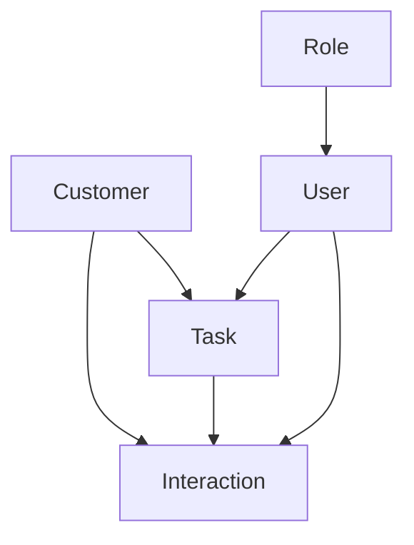

# Domain & Project Knowledge: Mini-CRM

## Domain Concepts
### CRM (Customer Relationship Management)
- Система управления взаимоотношениями с клиентами
- Отслеживание взаимодействий
- Управление задачами и напоминаниями

### Основные сущности
- Клиент (Customer)
- Взаимодействие (Interaction)
- Задача (Task)
- Пользователь (User)
- Роль (Role)

## Relationship Map

## Key Resources
### Документация
- Laravel Documentation
- Vue.js Documentation
- MySQL Documentation
- API Documentation

### Инструменты
- Laravel Telescope
- Laravel Debugbar
- Postman
- Git

## Project Best Practices
### Код
- PSR-12 для PHP
- ESLint для JavaScript
- Prettier для форматирования
- Git Flow для ветвления

### Безопасность
- CSRF защита
- XSS защита
- SQL инъекции
- Валидация входных данных

### Тестирование
- Unit тесты
- Feature тесты
- Integration тесты
- E2E тесты

## FAQ
### Общие вопросы
1. Как добавить нового пользователя?
2. Как настроить права доступа?
3. Как экспортировать данные?

### Технические вопросы
1. Как обновить зависимости?
2. Как запустить тесты?
3. Как развернуть проект?

## Implicit Knowledge
### Процессы
- Процесс разработки
- Процесс деплоя
- Процесс тестирования
- Процесс code review

### Конвенции
- Именование файлов
- Структура кода
- Комментарии
- Логирование 